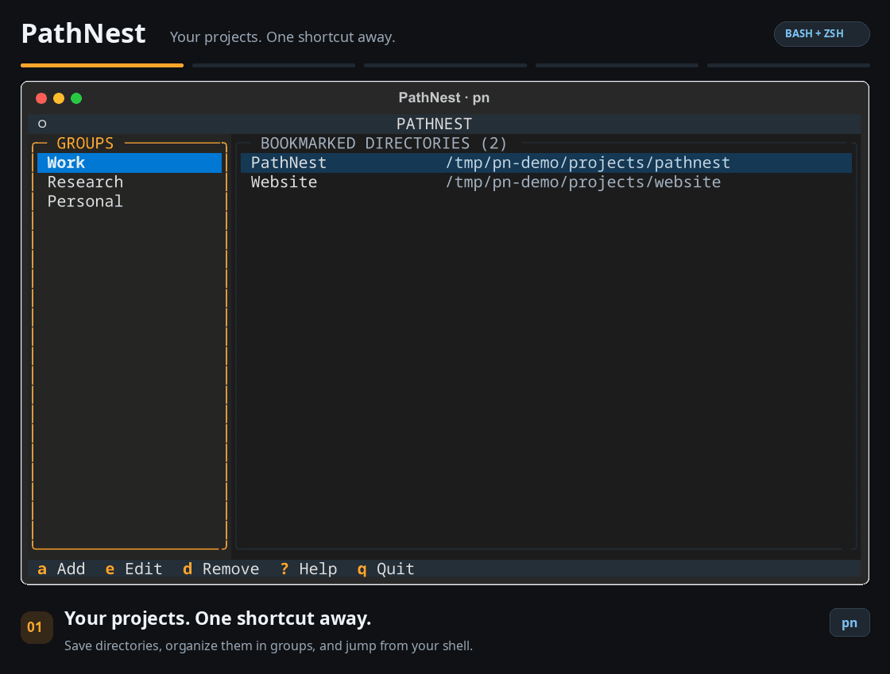

# PathNest


Stop typing long `cd` commands. Save your project directories in groups, pick one, press Enter. Your terminal is now there.



- **Two-panel TUI**: groups on the left, bookmarks on the right, keyboard only.
- **Shell navigation**: Enter on a bookmark closes the TUI and `cd`s your current shell.
- **One binary, one JSON file**: no runtime Python, no database, no background service.

## Install

Linux with Python 3.9+ (Fedora: `sudo dnf install python3`). No root required.

```bash
git clone https://github.com/HosseinBazeghi/pathnest.git
cd pathnest
./build.sh
```

`build.sh` builds a standalone binary, installs it to `~/.local/bin`, and sets up shell integration. Open a new terminal and run:

```bash
pn
```

## Keys

| Key | Action |
|-----|--------|
| `↑` `↓` | Move selection |
| `Tab` | Switch panel |
| `Enter` | Open group (left) / `cd` to directory (right) |
| `a` | Add group or bookmark |
| `e` | Edit selection |
| `d` | Remove selection |
| `?` | Help |
| `q` | Quit, directory unchanged |

New bookmarks default to the current directory. Paths are validated, `~` is expanded, and names, groups, and paths are all yours to set.

## CLI

Everything also works without the TUI:

```bash
pn add                                  # bookmark the current directory
pn add --group Research --name Thesis ~/university/thesis
pn go thesis                            # jump straight there, no TUI (fuzzy: "pn go thesi" asks)
pn group add Research
pn group rename Research Science        # bookmarks are kept
pn list
```

## Data

Bookmarks live in `~/.config/pathnest/bookmarks.json`. XDG aware, atomic writes, created on first run.

New bookmark paths are absolute and retain symbolic links. Legacy relative paths are interpreted relative to the configuration directory; edit any that were saved from a different directory. Concurrent edits are rejected with a retry message rather than overwriting another instance's changes.

```bash
pn --config /path/to/file.json          # or: export PATHNEST_CONFIG_FILE=...
```

## Develop

```bash
python3 -m venv .venv && . .venv/bin/activate
pip install -e ".[dev]"
pytest
```

MIT license.
